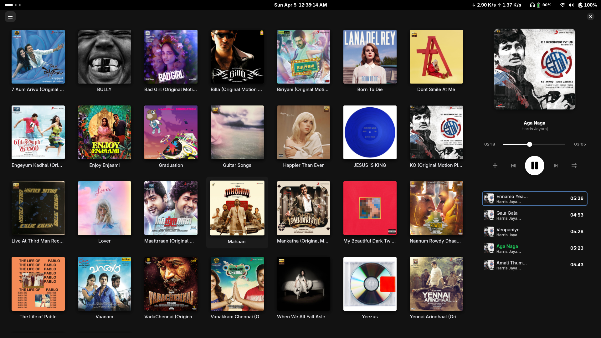

<div align="center">


# PacTune

A modern, lightweight music player for Linux — built with Rust and GTK4.

[](https://rust-lang.org)
[](https://gtk.org)
[](#license)

</div>

---

## About

PacTune is a clean, fast music player designed for Linux desktop environments. Built from scratch with Rust and GTK4, it focuses on simplicity and performance while providing all the essential features you need for your music library.

---

## Features

- **Album Grid View** — Browse your music library with beautiful cover art in a responsive grid layout
- **Album Detail Pages** — Click any album to view all its tracks in an organized card layout
- **Synchronized Lyrics** — Automatically displays time-synced lyrics from `.lrc` files or fetches them online
- **Modern Dark Theme** — Beautiful Libadwaita styling that integrates perfectly with GNOME
- **MPRIS Support** — Control playback from your desktop media controls and system tray
- **Playback Modes** — Shuffle, repeat track, or repeat playlist
- **Drag & Drop** — Simply drag audio files or folders into the window
- **Session Restore** — Automatically restores your last playlist on launch
- **Keyboard Shortcuts** — Press spacebar to play/pause from anywhere
- **Trackpad Gestures** — Swipe right with two fingers to navigate back

---

## Screenshots

<div align="center">
  
</div>

---

## Installation

### Quick Install (Universal)

```bash
git clone https://github.com/codemonkx/PacTune.git
cd PacTune
chmod +x install.sh
./install.sh
```

The installer will:
- Check for required dependencies (GTK4, Libadwaita, GStreamer)
- Build the release binary with Cargo
- Install to `~/.local/bin/pactune` (no root required)
- Set up desktop entry, icon, and D-Bus service
- Make PacTune available in your application launcher

### Development Mode

For quick testing during development:

```bash
chmod +x reinstall.sh
./reinstall.sh
```

This script rebuilds and reinstalls the app instantly, perfect for iterating on changes.

---

## Usage

### Getting Started
1. Launch PacTune from your application launcher or run `pactune` in terminal
2. Click "Open Folder" to add your music library
3. Switch to the "Albums" tab to browse by album

### Controls
- **Play/Pause** — Click the play button or press spacebar
- **Next/Previous** — Use the skip buttons or media keys
- **Seek** — Click anywhere on the progress bar
- **Volume** — Adjust with the volume slider
- **Shuffle** — Toggle shuffle mode
- **Repeat** — Cycle through: no repeat → repeat playlist → repeat track

### Navigation
- **Album View** — Click any album to see its tracks
- **Back** — Click the back arrow or swipe right (trackpad)
- **Lyrics** — Toggle the lyrics view to see synchronized lyrics

---

## Building from Source

### Prerequisites

- Rust (1.70+)
- GTK4
- Libadwaita
- GStreamer with playback plugins
- pkg-config

### Build

```bash
cargo build --release
```

The binary will be at `target/release/PacTune`

---

## Technical Stack

- **Language**: Rust
- **GUI Framework**: GTK4 + Libadwaita
- **Reactive Framework**: Relm4
- **Audio Backend**: GStreamer
- **Metadata**: Lofty
- **Lyrics**: Custom fetcher with lyrx parser

---

## Roadmap

- [ ] Playlist management
- [ ] Search functionality
- [ ] Equalizer
- [ ] Last.fm scrobbling
- [ ] Custom themes
- [ ] Podcast support

---

## Author

**Nithin** ([@codemonkx](https://github.com/codemonkx))

Built with passion for music and open source.

---

## License

[GNU General Public License v3.0](LICENSE)

This program is free software: you can redistribute it and/or modify it under the terms of the GNU General Public License as published by the Free Software Foundation, either version 3 of the License, or (at your option) any later version.

